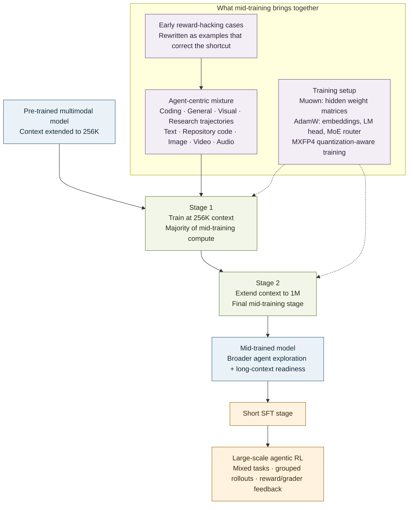

# MiMo-V2.6 mid-training: a flow diagram

## The short version

Mid-training is the bridge between a broadly capable pretrained model and the later agent-RL run. It adds agent-oriented experience, grows the context window for long interactions, and adapts the optimization setup for large-batch training. [§3.2, p. 7]

It starts from the two-stage [pre-training recipe](PRE-TRAINING.md): text-only language training followed by joint omni-modal training.

## How to read it

### 1. The data expands what the model can explore

The mixture combines realistic agent trajectories from coding, general, visual, and research tasks with high-quality text, repository-level code, and image, video, and audio data. The purpose is not just to teach final answers: interaction examples give the policy more patterns for acting, observing results, and continuing through a task. [§3.2, p. 7]

The paper also says early RL experiments exposed reward-hacking behavior. The team synthesized corrective examples from those cases—making the faulty reasoning recognizable, then revising it toward actions grounded in the task—and included them in mid-training. This means the data mixture responds to failure modes observed in early experiments, rather than consisting only of successful demonstrations. [§4.2.6, p. 14]

### 2. The context schedule is staged

Mid-training first runs at **256K context**, with most of its compute allocated to that stage. The final stage extends context to **1M**. In practical terms, the model gets a long-context base before the main RL phase generates extremely long, multi-turn trajectories. [§3.2, p. 7]

### 3. The training recipe changes with the goal

The pretrained model used AdamW, but mid-training switches hidden weight matrices to **Muown**, a Muon variant with explicit row-norm control. Embeddings, the language-model head, and the MoE router continue to use AdamW. The report motivates Muown as better suited to large-batch optimization; it reports no loss spike during the switch in its mid-training runs. **MXFP4 quantization-aware training** prepares the model for low-precision computation. [§3.2, p. 7]

### 4. Mid-training prepares; it does not replace RL

The mid-trained checkpoint is followed by a short SFT stage, then large-scale RL. RL adds the repeated environment interaction and reward-based policy updates. So the roles are distinct:

| Stage | Main job |
|---|---|
| Pre-training | Build broad language and multimodal capabilities |
| Mid-training | Add agentic experience, long context, and large-batch readiness |
| Short SFT | Establish the immediate policy starting point for RL |
| RL | Improve behavior through grouped task attempts and feedback |

The paper presents these stages as a recipe, not as a component-by-component ablation. Its results therefore do not isolate how much each mid-training choice contributes on its own. [§3.1–3.2, p. 7; §4, p. 8; §5.1, p. 20]

**Source:** [*MiMo-V2.6: Scaling Reinforcement Learning Towards Self-Improvement*](https://www.alphaxiv.org/abs/2609.mimo-scaling-reinforcement-learning), especially §3.2 and §4.2.6.
