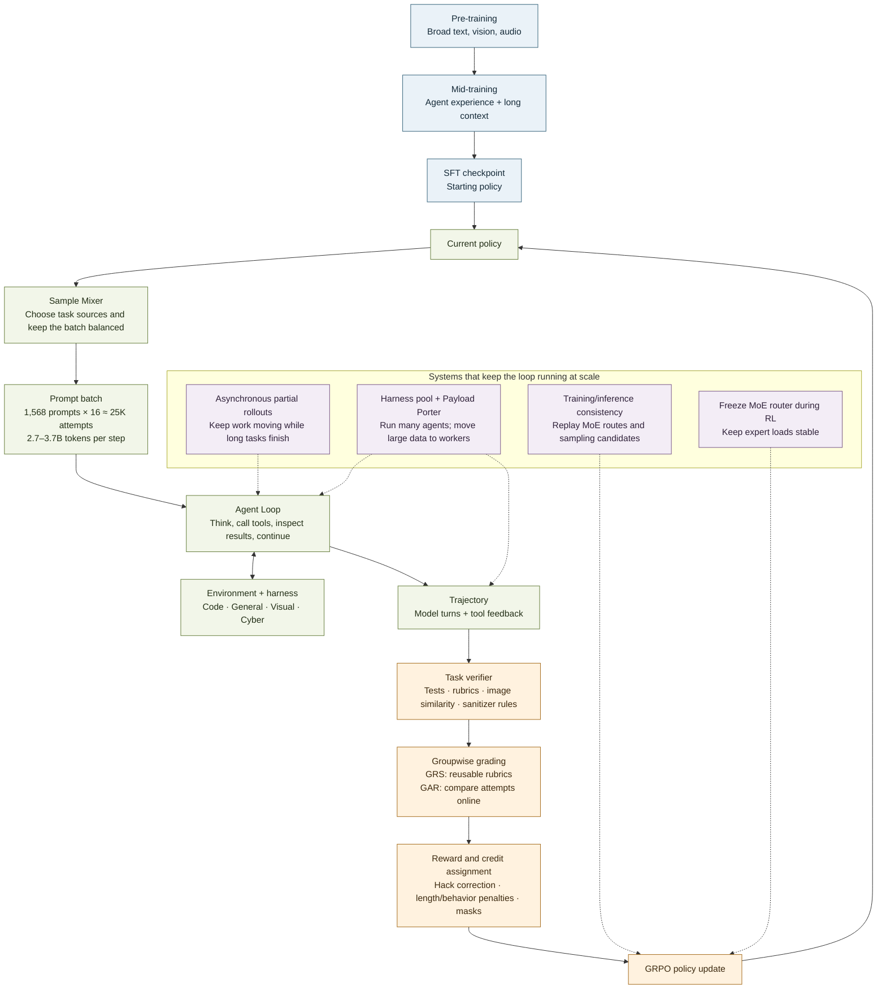

# MiMo-V2.6 in one picture

The simplest way to read this paper is as a **practice loop**: prepare a capable model, let it attempt real tasks, judge the attempts, then update the model from that feedback. The paper’s main point is that this loop only scales when the task worlds, graders, and computing system scale with it.

## Read the arrows

1. **Prepare the learner.** Pre-training gives the model broad capabilities; mid-training adds agent-oriented experience and extends context; SFT supplies the starting policy. RL builds on this foundation rather than starting from an untrained model. See the [expanded mid-training diagram](MID-TRAINING.md). [§3, p. 7; §4, p. 8]
2. **Give it a task and room to act.** The Sample Mixer selects from different task sources. The main run uses 1,568 prompts with 16 attempts each—about 25K trajectories and 2.7–3.7B tokens per step. Each Agent Loop interacts with an environment through a harness and creates a multi-turn trajectory. [§4.1, pp. 8–9; §5.1, p. 20; §6.1, pp. 26–27]
3. **Turn outcomes into a useful lesson.** A verifier checks task success. GRS adds reusable task rubrics; GAR compares a group of attempts and shifts positive learning credit toward better successful solutions. Reward-hack correction and behavioral penalties try to keep the signal aligned with the intended task. [§4.2–4.3, pp. 9–20]
4. **Update, then repeat.** GRPO uses the group-derived advantages to update the policy. Asynchronous execution, distributed trajectory storage, and training–inference consistency mechanisms make that cycle practical at the reported scale. [§5.1, pp. 20–21; §6, pp. 26–33]

## The coach analogy

If the model is a learner, then:

- **Environment + harness** are the practice task and the tools available to do it.
- **Verifier** is the answer check: did the requested outcome happen?
- **GRS/GAR grader** is a coach comparing how the attempts solved it, not just whether they passed.
- **GRPO update** adjusts which behaviors the model is more likely to use next time.
- **Infrastructure** is the practice facility that lets thousands of long attempts run without losing the data or changing what is being measured.

The analogy has one important limit: neither tests nor model graders are perfect coaches. That is why the paper also audits tasks for false rewards, screens environments for exploits, and monitors the system for training failures.

## What to notice

The model’s improvement is not credited to an optimizer alone. The feedback path determines what “better” means, while the execution system determines how much and what kind of experience reaches the update. This is the core design idea that connects the paper’s algorithm, grading, environments, and infrastructure.

**Paper:** [*MiMo-V2.6: Scaling Reinforcement Learning Towards Self-Improvement*](https://www.alphaxiv.org/abs/2609.mimo-scaling-reinforcement-learning).
