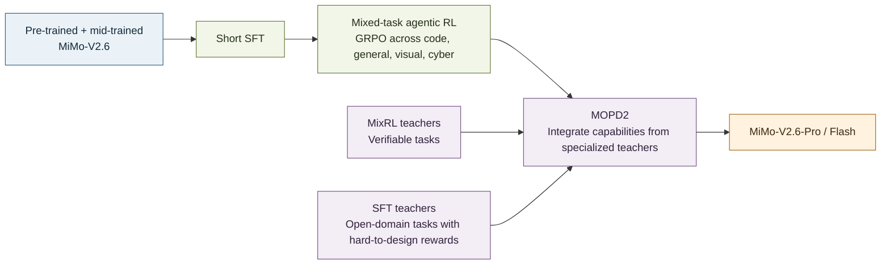
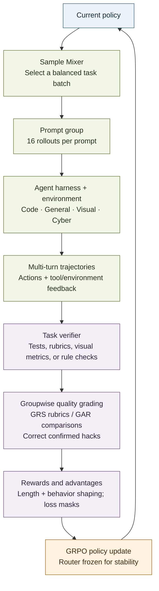
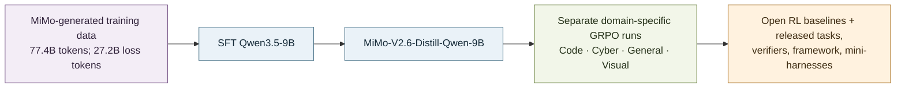

# MiMo-V2.6 post-training: a flow diagram

Post-training has **two related but distinct tracks** in the report: the flagship Pro/Flash training path and the smaller open 9B research path. Keeping them separate makes the evidence much easier to interpret.

## 1. Flagship MiMo-V2.6 path

The main model is already pretrained and mid-trained before post-training begins. A short SFT stage is followed by mixed-task RL. After mixed RL, **MOPD2** combines teachers: mixed-RL teachers for verifiable tasks and SFT teachers for open-domain tasks where reliable reward design is difficult. [§4, p. 8; §5.1, p. 20; §5.6, pp. 24–25]

## 2. What happens inside the main RL loop

The flagship batch uses **1,568 prompts × 16 rollouts**, or about 25K trajectories and 2.7–3.7B tokens per step. GRPO learns from group-relative advantages. Verifiers establish task outcomes; GRS adds reusable quality rubrics on selected high-pass-rate code tasks, while GAR compares attempts online on other code tasks. Length penalties, segment-level behavior penalties, and confirmed-hack correction refine the signal. [§4.1, pp. 8–9; §4.3, pp. 16–20; §5.1, pp. 20–21]

## 3. Open 9B research path

This is the open research track, not a reproduction of the trillion-parameter mixed-task run. The team distills MiMo-generated data into a Qwen3.5-9B SFT checkpoint, then runs GRPO separately on released domain environments. The released task sets total about 7K across code, cyber, general, and visual domains, with roughly another 1K music-generation tasks in the training resources. [§7.1–7.2, pp. 33–35, Tables 4–6]

## MOPD2 in plain language

MOPD2 means **Multi-Prefix Multi-Teacher On-Policy Distillation**. It gives the student token-level guidance from different teachers depending on the task:

- On verifiable tasks, the student can generate a full rollout and learn from a mixed-RL teacher.
- On tasks with difficult-to-design rewards, an SFT teacher trained on synthetic demonstrations can provide guidance.
- Prefix-conditioned OPD reuses a history from a teacher trajectory or SFT example, then has the student generate the next turn itself. It does not simply copy a fixed continuation.

This broadens the post-trained model beyond tasks with convenient automatic verifiers, while still relying on teacher-generated supervision. [§5.6, pp. 24–25, Fig. 13]

## The three stages to remember

**SFT gives a starting behavior → RL improves behavior through environment outcomes and group comparisons → MOPD2 transfers capabilities from specialized teachers.** The open 9B work follows a parallel SFT-then-RL path to make parts of this research reproducible at smaller scale.

**Source:** [*MiMo-V2.6: Scaling Reinforcement Learning Towards Self-Improvement*](https://www.alphaxiv.org/abs/2609.mimo-scaling-reinforcement-learning), §§4–7.
