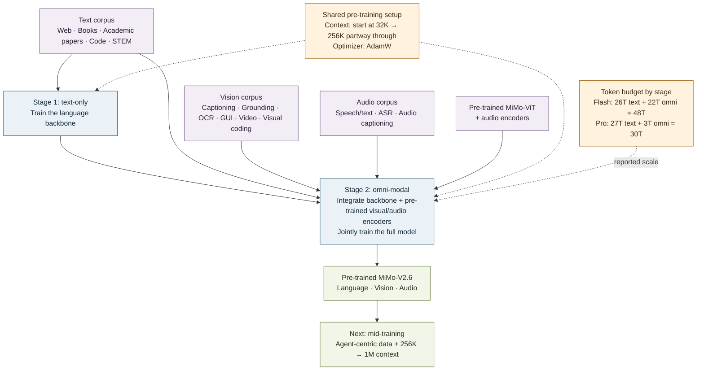

# MiMo-V2.6 pre-training: a flow diagram

## The short version

Pre-training proceeds in two stages: first build the language backbone on text alone; then bring in pre-trained visual and audio encoders and train the full model on omni-modal data. The paper starts with 32K context and extends it to 256K partway through pre-training. [§3.1, p. 7]

## How to read it

### 1. First teach the language backbone from text

The text corpus includes public web content, books, academic papers, code, and STEM material. Stage 1 trains the language backbone on text-only data to establish its foundational language capabilities. [§3.1, p. 7]

### 2. Then teach the full model across modalities

Stage 2 combines the language backbone with the in-house pre-trained visual and audio encoders. The full model is jointly trained on omni-modal data so it can understand text together with images, video, and audio. The paper’s vision data includes captioning, grounding, OCR, GUI, conversation, video, and visual coding. Audio data is organized around speech-text interleaving, automatic speech recognition, and general audio captioning. [§2.1–2.3, pp. 4–5; §3.1, p. 7]

The two stages are a progression: start with a strong text model, then teach the multimodal system to use its additional input pathways. “Omni-modal” does not mean replacing text; text remains part of the model and the overall training mixture.

### 3. Context and token budgets differ by model

Pre-training begins at **32K context** and extends to **256K** partway through training. Flash receives **48T tokens** total—26T in the text stage and 22T in the omni-modal stage. Pro receives **30T**—27T text and 3T omni-modal. The different stage splits are part of the reported setup; they should not be read as a controlled comparison of text versus multimodal token value. [§3.1, p. 7]

The pre-training optimizer is **AdamW**. The later move to Muown and MXFP4 quantization-aware training belongs to mid-training, not this pre-training recipe. [§3.1–3.2, p. 7]

### 4. The handoff

Pre-training produces the broad multimodal foundation. **Mid-training** then adds agent-centric trajectories, extends context from 256K to 1M, and prepares optimization for large-batch learning. The next step is a short SFT stage before the large RL run. [§3.2, p. 7; §4, p. 8; §5.1, p. 20]

**Source:** [*MiMo-V2.6: Scaling Reinforcement Learning Towards Self-Improvement*](https://www.alphaxiv.org/abs/2609.mimo-scaling-reinforcement-learning), especially §§2–3.
